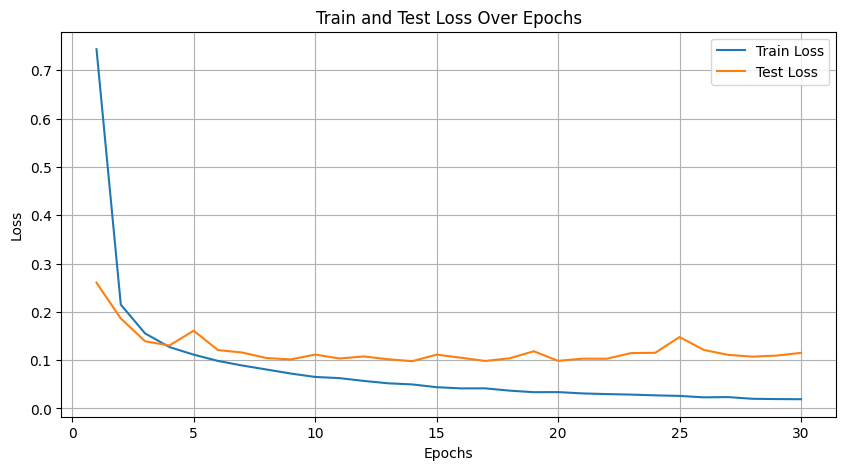
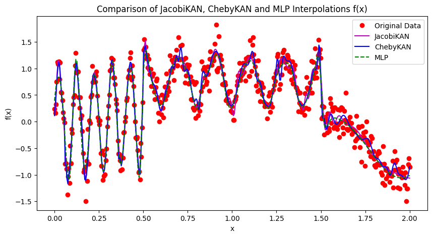

## This is a VERY COARSE version and absolutely NOT FULLY TESTED! it's only intended for experiementing! Any discussion and criticism are welcome! Check the issues for more information!

## This repo is developed based on [ChebyKAN](https://github.com/SynodicMonth/ChebyKAN/)

# JacobiKAN
Kolmogorov-Arnold Networks (KAN) using Jacobi polynomials instead of B-splines.

This is inspired by Kolmogorov-Arnold Networks <https://arxiv.org/abs/2404.19756v2>, which uses B-splines to approximate functions. B-splines are poor in performance and not very intuitive to use. I'm trying to replace B-splines with  Jacobi polynomials.

[Jacobi polynomials](https://en.wikipedia.org/wiki/Jacobi_polynomials) are orthogonal polynomials defined on the interval [-1, 1]. They are very good at approximating functions and can be calculated recursively. [Chebyshev polynomials](https://en.wikipedia.org/wiki/Chebyshev_polynomials) and some other orthogonal polynomials are special cases of it.

A simple (and naive) implementation of JacobiKANLayer is provided in `JacobiKANLayer.py`. Its not optimized yet.

# Usage
Just copy `JacobiKANLayer.py` to your project and import it.
```python
from JacobiKANLayer import JacobiKANLayer
```

# Example
Construct a ChebyKAN for MNIST
```python
class MNISTJacobiKAN(nn.Module):
    def __init__(self):
        super(MNISTChebyKAN, self).__init__()
        self.jacobikan1 = JacobiKANLayer(28*28, 32, 4)
        self.ln1 = nn.LayerNorm(32) # To avoid gradient vanishing caused by tanh
        self.jacobikan2 = JacobiKANLayer(32, 16, 4)
        self.ln2 = nn.LayerNorm(16)
        self.jacobikan3 = JacobiKANLayer(16, 10, 4)

    def forward(self, x):
        x = x.view(-1, 28*28)  # Flatten the images
        x = self.jacobikan1(x)
        x = self.ln1(x)
        x = self.jacobikan2(x)
        x = self.ln2(x)
        x = self.jacobikan3(x)
        return x
```
**Note:** Since Jacobi polynomials are defined on the interval [-1, 1], we need to use tanh to keep the input in that range. We also use LayerNorm to avoid gradient vanishing caused by tanh. Removing LayerNorm will cause the network really hard to train.

Have a look at `Jacobi-KAN_MNIST.ipynb`, `Function_Interpolation_Test.ipynb`, and `Multivar_Interpolation_Test.ipynb` for more examples.

# Experiment Results
**MNIST:** ~97% accuracy after about 10 epochs. Faster than ChebyKAN, which needs about 20 epochs
```
Epoch 1, Train Loss: 0.7438, Test Loss: 0.2603, Test Acc: 0.94
Epoch 2, Train Loss: 0.2149, Test Loss: 0.1863, Test Acc: 0.95
Epoch 3, Train Loss: 0.1553, Test Loss: 0.1390, Test Acc: 0.96
Epoch 4, Train Loss: 0.1271, Test Loss: 0.1303, Test Acc: 0.96
Epoch 5, Train Loss: 0.1113, Test Loss: 0.1609, Test Acc: 0.96
Epoch 6, Train Loss: 0.0984, Test Loss: 0.1208, Test Acc: 0.96
Epoch 7, Train Loss: 0.0889, Test Loss: 0.1157, Test Acc: 0.96
Epoch 8, Train Loss: 0.0806, Test Loss: 0.1043, Test Acc: 0.97
Epoch 9, Train Loss: 0.0722, Test Loss: 0.1015, Test Acc: 0.97
Epoch 10, Train Loss: 0.0652, Test Loss: 0.1115, Test Acc: 0.97
Epoch 11, Train Loss: 0.0627, Test Loss: 0.1034, Test Acc: 0.97
```

The network parameters are [28*28, 32, 16, 10] with 4 degree Jacobi polynomials.

It needs a low learning rate (2e-4) to train. The network is very sensitive to the learning rate.

Note that it's still not as good as MLPs. Detailed comparison is on the way.

---

<!-- **Function Interpolation:** converge faster than MLPs when the function is (mostly) smooth.




JacobiKAN: [1, 8, 1] with 8 degree.
ChebyKAN:  [1, 8, 1] with 8 degree.
MLP:     [1, 128, 1] with Tanh.

With decent training, the MLP can achieve similar performance as ChebyKAN. Note that ChebyKAN shows some overfitting.

However ChebyKAN converges much faster than MLP.


ChebyKAN: Adam, lr=0.01.
MLP: Adam, lr=0.03.

@5000 epoch, ChebyKAN has already converged, while MLP is still far from convergence.


# Future Work
More experiments and optimizations are needed to prove the correctness and effectiveness of ChebyKAN. 
Not sure if the current parameters initialization is optimal. Maybe Xavier initialization is better.
I'm not sure if the current implementation is correct. Any suggestions are welcome. -->